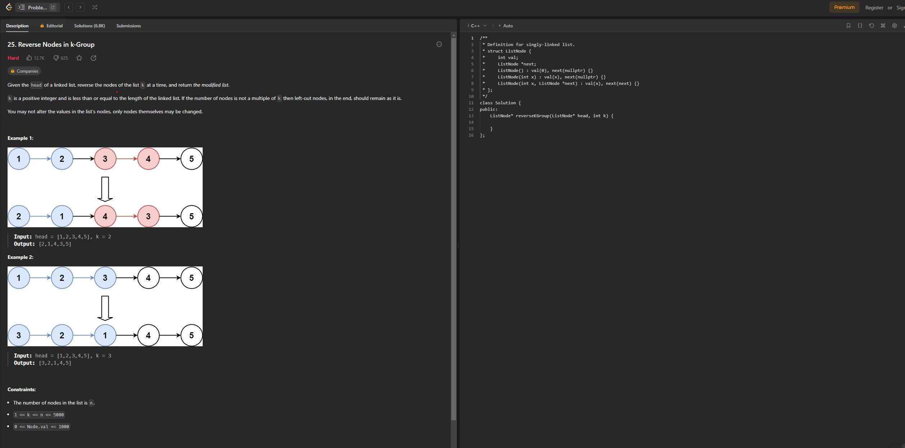

<!--
id: 7457e2c96e5711ee8ab068545a57002a
title: Why don't I like OAs & how to design a good OA
date: 2023/10/19
color: #ff8a65
brief: My thoughts and comments on tech job market these days
cover: https://raw.githubusercontent.com/MohaElder/me/main/src/assets/blogPics/oa/max-howell-tweet-3657821630.jpg
cover-caption: The creator of HomeBrew, Max Howell, tweeted this after he has been struggling with a technical assessment with Google
type: comment
published: true
-->

OA is an abbreviation for Online Assessments. They are broadly used by companies to test job candidates' coding skills for tech positions.

Normally, an OA is conducted on a website that presents one or several coding questions. The candidate sometimes has an online IDE within that website to complete it, while others might submit their results afterward. Most OAs are timed, and candidates can choose their preferred programming language to answer the questions.

OAs often represent the second stage in the hiring process. Typically, the process unfolds as follows:

1. Submission of application.
2. HR reviews applications, sometimes making selections at random. Note: Occasionally, OAs are administered at this stage to expedite the hiring process.
3. Candidates are provided with an OA, and their performance is evaluated.
4. Initial interview with HR to gauge cultural fit ("vibe check") and to discuss logistical details like starting dates and visa requirements, especially for candidates applying from abroad.
5. One or more technical interviews conducted by HR, the hiring manager, or other relevant staff members.
6. Secondary "vibe check" interview, primarily with the hiring manager, and occasionally with HR or senior leadership.
7. Background Check.

In summary, OAs are considered a highly effective and methodical approach to ascertain whether a candidate's programming skills align with the job's specifications.

<figcaption>An example of an OA from leetcode</figcaption>

From the title, you can probably guess I'm not a big fan of Online Assessments (OAs). I don't think they always show what someone can really do.

Before I dive in, I want to make something clear: I'm not just writing this because I had one bad experience with an OA.

### My Situash
1. I just took an OA and it didn't go well, which led me to write this blog.
2. Math and algorithms aren't my strong suits.
3. I'm job hunting, and OAs are making it tougher for me.

Knowing where I'm coming from, you can tell I have some strong feelings about OAs. However, I promise I've tried to write this blog as fairly as I can. To show that I'm being open about it, here are some HeadsUps:

### Heads Up!
1. Not all OAs are the worst - I'll get into that. But, let's be honest, many of them are a pain.
2. I've cleared some OAs, the cool ones and the not-so-cool ones.
3. Just to be clear, I'm talking about engineering jobs here. If you're into Algorithms or Science roles, this isn't about those.
4. And yep, I'm sober writing this.

Ok, let's start ;)

## I don't like most OAs because they don't really match the JD(Job Description)

If you have ever done OA, you definitely encountered the following situation:

You are applying for a Frontend Engineer Internship from some company you never know but it's on Linkedin job board. The JD says you should have good knowledge of React, JavaScript, and Webpack. It is preferred that if you have knowledge on Python(Pandas, Pydantic, Django), Docker and Postman.

So, you guess they're using React for the front end and Django for the back end. Your main role would be with React, but sometimes you'd chip in with QA, DevOps, and some backend work using Django. Sounds awesome, right? You've been wanting to level up your Docker game from just copying commands from StackOverflow to mastering Kubernetes anyway.

Being in your third year of a Computer Science program, you've studied stuff like Red Black Trees and Huffman Encoding. Heck, you've even dived deep into dynamic programming, learning to design and analyze it. On your own time, you picked up React and even built a project with it. Plus, you've done a full-stack project combining React and Django for a school activity. Feeling pretty good about your skills, you decide to apply for the job.

Luckily, instead of a rejection, you received a "rare" OA invitation. So, you opened up the OA, ready to tackle some React questions. BUT THEN, there was this intricate question about reversing nodes in a tree, with requirements that took you 30 minutes just to grasp. In the end, the system automatically submitted your in-progress code, littered with log functions. Congratulations, you probably feel just as frustrated as I did back then. :)

This story might be a bit lengthy, but the key takeaway is this: Many OAs in the job market do **not** accurately represent the tasks you'd be expected to perform in the actual job.

It's not uncommon for companies to assign candidates OAs that are much more challenging or out of scope compared to the daily responsibilities of the role. Several of my friends have shared that the most difficult coding challenge they faced in their job was the OA they took during the application process.

If you're familiar with the tech job market, you might notice I haven't mentioned websites like LeetCode or CodeSignal. While it's true many recognize the demanding nature of OAs and turn to these platforms to practice, it's a double-edged sword. Practicing on these sites can be beneficial; many of the challenges are intriguing, enhancing both your chances of landing a job and your coding abilities. **However, overdoing it is stupid, and I believe the blame lies with the companies.**

The primary reason that excessively practicing OAs is misguided is because it doesn't genuinely reflect one's actual programming skills. Practicing numerous OAs before taking the real assessment is analogous to cramming for an exam. Many hope to practice enough problems so that the real OA mirrors something they've encountered previously. In such scenarios, all they end up doing is regurgitating what they've memorized to achieve a high score quickly. This approach is how an overly challenging OA can mislead both the applicant and the hiring company. The candidates often lack a comprehensive understanding of what they're coding, and the company doesn't receive an honest evaluation of the applicant's abilities. Consequently, companies might end up hiring individuals who excel at rote learning OAs rather than genuine problem-solving.

<figcaption>A leetcode statistics board from an user online</figcaption>

This perspective also counters a possible counterargument: if someone can ace a challenging OA, they'd excel at the actual job. When a company selects someone who has passed an OA that greatly diverges from the JD, it's likely that the individual devoted a significant amount of time perfecting their OA technique. Typically, unless you're extraordinarily gifted, the proficiency to clear demanding OAs comes at the cost of neglecting genuine software engineering skills. If you invest most of your time on platforms like LeetCode, how can you find the time to refine your software engineering capabilities or undertake impactful projects?

Furthermore, it's widely acknowledged that excelling in algorithms and mathematics doesn't automatically translate to expertise in software engineering. These are distinct domains. Many "hacks" devised to optimize runtime and memory utilization of a solution are, in fact, antithetical to sound software engineering practices.

A lot of these hacks compromise code readability and robustness. Consider the implementation of a hash table with an array. A conventional method to scale it involves creating a new array larger than the current one and transferring all the elements. A standard approach might double the hash table's size during expansion, ensuring average-case performance. However, a frequently seen "shortcut" in OAs is to increase the size tenfold rather than doubling it. While this might seem to offer runtime benefits due to fewer expansions, it's a flawed approach.

Such a technique might perform well in OA settings where test coverage is limited, but in real-world applications, this would likely result in colossal memory consumption. Imagine the implications of an array of size 10,000 being expanded to 100,000. This leads to a significant waste of storage space. This tendency to rely on hacks is also evident among many IOI (International Olympiad in Informatics) participants, often leading to subpar software engineering practices. These shortcuts, derived from optimized solutions in controlled environments (specific test cases and assured conditions), don't typically align with real-world software engineering challenges.

<figcaption>logo of International Olympiad in Informatics</figcaption>

In summary, OAs that don't align with the job description (JD) present several issues:

1. Excelling in these OAs doesn't ensure a candidate's competence in the actual job.
2. Individuals often resort to cramming for OAs, diverting time and effort away from genuinely honing relevant skills.
3. This trend perpetuates a vicious cycle, reinforcing the problems outlined in points 1 and 2, and exacerbating the situation over time.

## Ok, so how to design a good OA?

Based on my personal experience with OAs and works, I think a good OA should meet the following criterias:

1. Align with what you are expected to work on
2. Evaluation Within the Software Engineering Context
3. Embracing Open Internet Access in Assessments

### Align with what you are expected to work on

This point is straightforward. If you're applying for a React position centered around creating React components, your assessment should be based on that very skill. The challenge should be moderately tough, as it directly pertains to the job role, helping to rank candidates based on performance effectively. A suitable test to gauge one's proficiency in crafting React components might look like this:

Duration: 1 hour

You're provided with a malfunctioning Checkout page developed using React. Your task is to identify and rectify its flaws. Once that's done, kindly integrate the following enhancements:

1. Develop a component that enables customers to pick from various currency denominations. The initial currency should correspond to the customer's location. Note: a mock location has been pre-configured in your workspace, so there's no need to request browser permissions. When a user alters the currency type, all listed prices should adjust accordingly. For this task, utilize the API: `https://some_api.com/api/country`.

2. Prioritize writing clean, robust code. We highly regard both readability and scalability. Where necessary, please add comments to elucidate your code.

3. Should time permit, incorporate a caching mechanism. This ensures that when a customer selects a currency preference, it's remembered and presented as their default during subsequent visits.

We will reference this example when discussing the next set of criteria.

### Evaluation Within the Software Engineering Context

In assessing an OA, it's crucial to look beyond just runtime and space utilization. In the realm of Software Engineering, stringent performance metrics and idealized OOP practices are sometimes bypassed in favor of established software design principles, such as  [SOLID](https://www.digitalocean.com/community/conceptual-articles/s-o-l-i-d-the-first-five-principles-of-object-oriented-design) and [KISS](https://en.wikipedia.org/wiki/KISS_principle).

Key evaluation criteria include:

1. Readability
2. Robustness
3. Optimal Runtime
4. Efficient Space Utilization
5. Scalability

Consider our previous React components OA example:

The first step is to conduct tests to ascertain functionality and optimization levels. Diving deeper into the code, it's essential to identify ambiguous variable names or unconventional algorithms. We should note if the candidate employs custom methods when pre-existing solutions might suffice. More often than not, built-in solutions surpass custom iterations, and leveraging what's readily available saves time and effort. Exceptions exist, of course, when dealing with innovators like Rich Harris or You Yu Xi. Lastly, we must examine the code's interdependencies. It's undesirable for a modification in one area, say a country code within an API, to inadvertently disrupt another component. For instance, encountering a scenario where adjusting the country API disrupts the currency unit component—because it stored API results in `localStorage` without periodic updates—would be far from ideal.

### Embracing Open Internet Access in Assessments

For software engineers, consulting the internet for syntax or method clarifications is a routine part of the job. Incorporating this reality into the OA process is entirely feasible, especially when the assessment is structured as an open-ended mini-project. While the internet might offer an optimal solution for challenges like ["reversing nodes in k-group"](https://leetcode.com/problems/reverse-nodes-in-k-group/), mentioned earlier, in a broader, project-based assessment, the best one might get is seeking guidance from tools like ChatGPT. But, as many are aware, ChatGPT can't provide complete solutions without a detailed prompt.

This leads to an interesting consideration: if a candidate can craft a prompt precise enough for ChatGPT to deliver a solution meeting all outlined criteria, it's indicative of their robust understanding of the project's requirements. Such a candidate is naturally suited for the role. Hence, it seems reasonable to permit candidates to access all available resources during an OA—resources they would typically use in their daily work. After all, search engines and AI tools are already integral to the software engineering workflow. Incorporating them into OAs provides a more authentic representation of job expectations.

### Conclusion

I apologize if my sentiments about past OAs come across as frustrated or disheartened, but I hope this blog offers some valuable insights.

If you're on the job hunt, please realize that struggling with excessively challenging OAs isn't a reflection of your competence. They often don't provide an accurate measure of your software engineering abilities, and rest assured, you will find a company that recognizes your talent. In my experience, among the companies I've collaborated with, one did not require an OA, while two others provided well-constructed OAs embodying the attributes I've discussed above.

For recruiters and hiring managers who distribute misrepresentative OAs, I hope this blog sheds light on the importance of tailoring assessments to truly gauge a candidate's abilities. Constructive OAs are beneficial for both candidates and companies alike. The job market has its disparities, but by assessing candidates judiciously, we can work towards a more equitable recruitment landscape for the betterment of all parties involved.