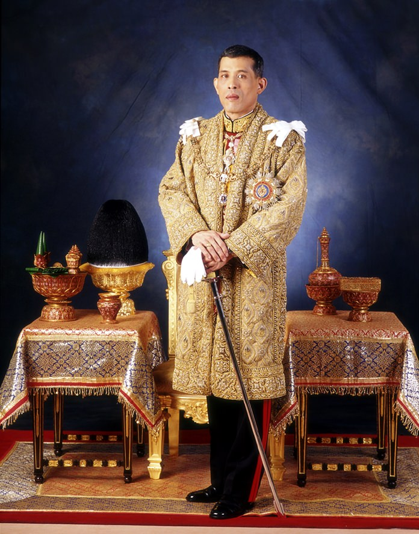
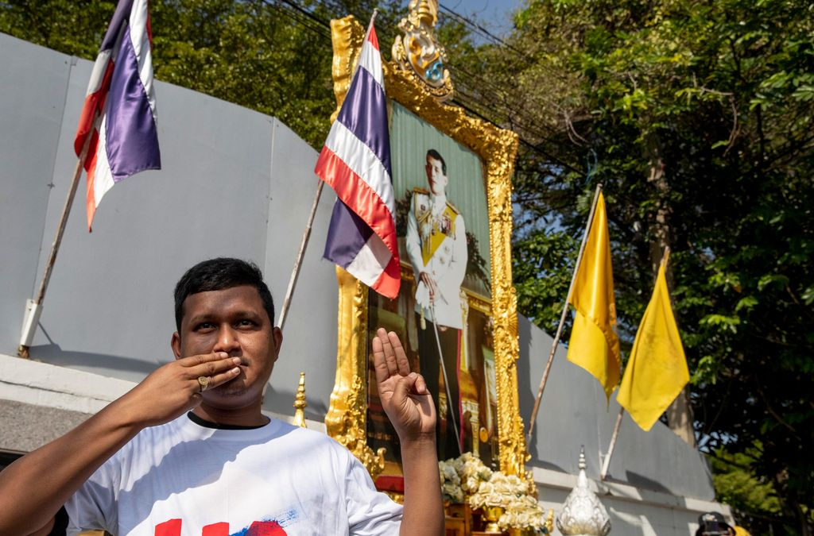
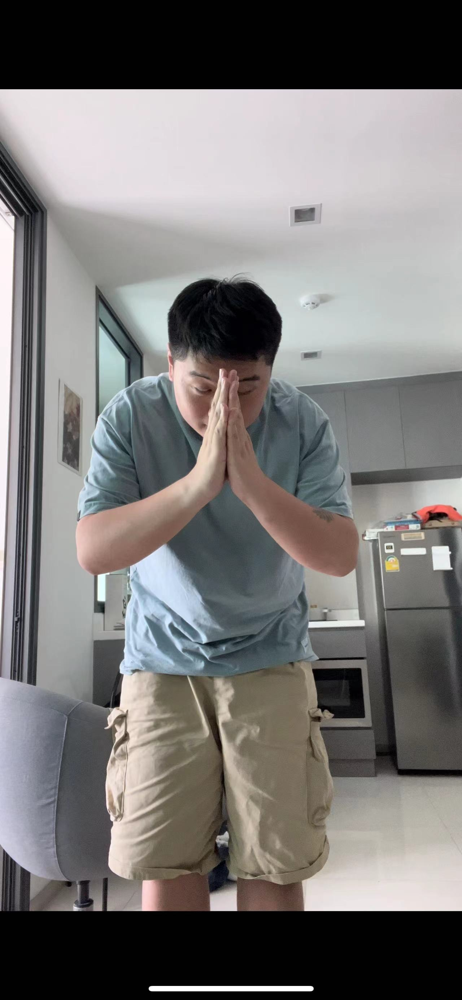
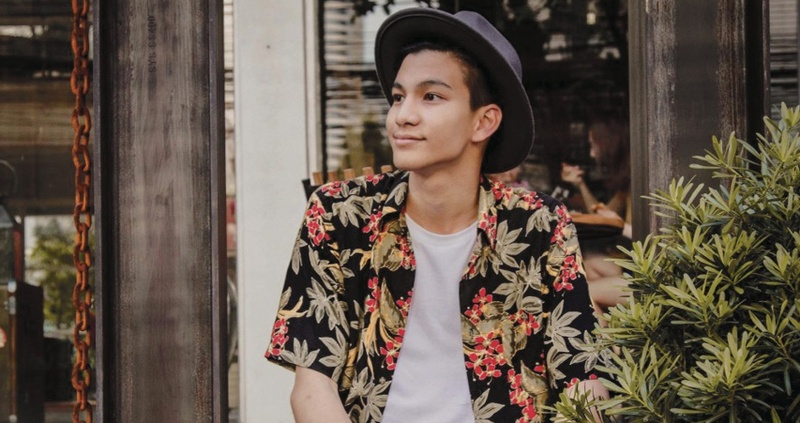
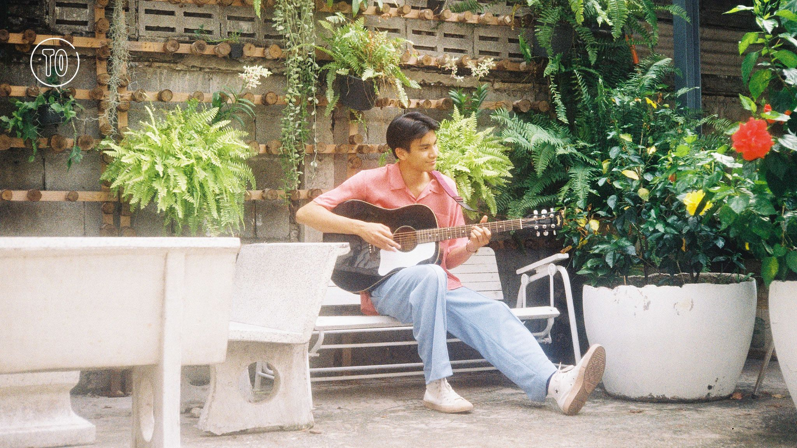

<!--
id: 86a0ab94050011eeb8d368545a57002a
title: 看上去像泰国人101
date: 2023/6/6
color: #64b5f6
brief: 如何看上去像一个泰国人，看这篇文章就够了
cover: https://cdn.jsdelivr.net/gh/mohaelder/me/src/images/DSCF1151.jpg
cover-caption: 
type: share
published: true
-->

**注意：这篇文章不能让你真正成为一个泰国人，融入当地文化需要很长时间，但是你可以靠阅读这篇文章变成一个“看上去”很土著的泰国居民**

## 该文章适用人群
- 不想被“坑”的泰国游客
- 想要深度/长时间游览泰国的游客
- 准备在泰国生活一段时间的人
- 想和朋友装逼显得自己很懂泰国的人
- 喜欢泰国的人
- 任何人

## 第一课：了解泰国
当我们来到一个国家，最重要的是学会和这里的人打交道，否则会寸步难行。泰国是一个拥有数百年历史的佛教国家，其文化文化多彩且历史悠久，处处都是庙宇和佛像。同时，泰国也是一个军政府半独裁国家（不过现在新选举的总理可能会改变这一切），在某些方面（比如言论自由）不是那么自由。泰国拥有全亚洲最有权力的皇室，他们被许多人爱戴且尊重。许多人对泰国的印象是一个穷国家，其实不然，泰国贫富差距巨大，有许多穷人，但不至于是柬埔寨那种四处乞讨的样子；泰国的富人非常非常有钱。其首都曼谷非常国际化，事实上曼谷是全亚洲国际化及包容度最强的城市。

## 扫盲清单
1. 泰国不穷，最穷的地方和贵州的山区差不多，平均水平介于四川和河北。泰国的首都曼谷和上海差不多发达，国际化和包容性略优于上海，但没有上海那么浪漫
2. 泰国不危险，最危险的地方在泰缅边境。在泰国被绑架到园区的可能性和你在国内被传销骗过去的可能性差不多。你在泰国最可能遇到的犯罪是偷窃
3. 泰国很热，除了10月到2月基本都是30到35度左右
4. 泰国的货币叫泰铢，thai baht
5. 泰国贿赂比较多，警察基本上是小事给点钱或者算了，大事很严重
6. 泰国人是世界上最友善，谦虚，礼貌的人。你不用担心把钱包落在了餐厅或者是问他们寻求帮助。人们会给你最大的善意和包容。
7. 虽然泰国人很友好很友好，但是如果你真的把他们惹急了他们会非常生气。
8. 泰国人民族主义情结很重，和大部分中国人差不多
9. 低于300株的商品不需要还价，已经是最低价了

## 第二课：了解泰国人
因为大部分人信佛的原因，绝大部分泰国人都特别友善。事实上，泰国人是我见过的世界上最友善的人群之一。我在泰国丢过一次钱包，一次手表；还有一次不小心把房租付给了别人。我全部都要回来了，而且是很快退回。他们比你还着急。泰国人的素质也都很高，大家谦让有礼，很多人现在还戴口罩。

虽然泰国人真的是世界上最友善的一群人，但是很多泰国人有很重的民族主义情结。泰国的国家机器会渲染很多强烈爱国主义的东西，然后因为泰国绝大部分人都是泰族人，导致了泰国人会认为泰国 = 泰人的国家，爱国 = 爱自己的民族。千万不要和陌生的泰国人讨论王室，泰国落后等问题。他们很大可能会和你急。

不过泰国人真的非常非常友善。有困难一定不要犹豫寻求当地人的帮助，有不少人会送佛送到西帮你帮到底。

 泰国的现任国王，你在泰国可以随处见到他的肖像 

## 第三课：正式开课！如何讨好泰国人

是的，你并不是泰国人，你对泰国的了解也不多。所以你想看上去像泰国人的话，得先确保你和真正的泰国人打好交道。

### 聊什么

如上文所述，大多泰国人民族主义情结很重。你和泰国人聊天，直接说你爱泰国就ok了（like伏拉夫）。你可以说你自己很喜欢泰国的文化，喜欢佛教，喜欢泰式建筑。如果你想装作一个对泰国文化略知一二的人，你可以和他们说你很想去Sukothai和Ayutthaya看古代泰国的遗址。90%的泰国人听到这两个地名就知道你真的是懂泰国历史的。

 Sukothai 和 Ayyutahya真的很漂亮 

当然了，一昧的夸赞当然不行。你可以和泰国人表达你对当地政府的一些担忧。比如对军政府的担心，以及当地百姓生活的顾虑。大多数泰国人都会在这些话题上和你侃侃而谈，并且在讨论的最后向你表达感谢你和他们讨论这些话题的情绪。他们会觉得你真的是关心泰国的。

以上这些建议都是肤浅的娱乐为主的建议👆，我建议大家想和泰国人聊什么就聊什么，真心才是和一个人打好关系的基础。当然了，避免讨论一些禁忌话题（王室）。不过如果你是和年轻人聊天的话，可以放心讨论王室，因为99%的泰国年轻人都不喜欢王室。

 抗议者比出《饥饿游戏》中知更鸟的手势表达反抗 

### 做什么

怎么和泰国人搭讪呢？很简单，如果是劳动人民（保安，司机等）直接递根烟给他们，然后和他们聊两句你们就是兄弟姐妹了。如果是同行的乘客，请放心和他们问候。你可以说Sawa Dee Ka，Sa baai dee mai？意思是你好，今天过得咋样。一般的路人都会和你聊两句，非常有意思。我会建议大家开头聊天气，因为泰国永远太热了。你直接和他们说wa nee roeng maak maak。他们就会感同身受并和你开始吐槽泰国的气温是有多糟糕。

 泰国热到狗都不想动 

## 第四课：泰语101

本章节将教会你最最基本但是实用的泰语，以及使用他们的方式。会了这些泰语后，你基本上可以和外国人伪装你是泰国人，同时在泰国通行无阻。

**在泰语当中基本上所有的话结尾都要加一个敬语，男生加Kap，女生加Ka。直接加在最后就好。后面我将统一使用女生的Ka作为敬语，请根据实际情况做出调整。**

首先，你在使用以下的泰语指南时，需要满足以下条件：
1. 尽可能礼貌，非常非常礼貌
2. 尽可能谦虚，非常非常谦虚。你就想象你是孔子，孔子怎么做你就怎么做
3. 永远在开始和结束对话的时候双手合十，弯腰，点头

 就像这样 

### 问路/寻求帮助
在泰国，当你想找人说话，一定要先说你好，并附上双手合十🙏的手势和点头。如果别人找你说话，你也需要做出手势和点头。然后你就可以和对面说英语或者直接打开翻译软件沟通。

建议步骤：

1. 微微点头弯腰，双手合十，然后说 你好Sawa Dee Ka（女生）/Sawa Dee Kap（男生）
2. 用英语问问题或者用翻译软件沟通
3. 结束对话后，微微点头弯腰，双手合十，说 谢谢Kop Kun Ka

### 买东西，打车等
虽然泰国人都很友善，但是生意归生意，确实是存在当地人多收外国人钱的情况的。虽然大部分不会多收很多，但是有一小部分坏人会狠狠宰你一刀。下面我将附上泰国买东西打车的基本物价，大家可以参考：

泰铢转人民币：1人民币 约等于 5泰铢

打车：除20km以上和早晚高峰，打车不会超过200珠。一个人旅行建议打摩的，是出租车价格的一半而且不堵车，不过有点危险需要注意安全。不建议坐突突车，很坑。打车可以用Grab或者Bolt打，类似Uber和滴滴。两个软件都可以直接付现金，不需要绑卡。

泰国传统服饰：除非是设计师品牌，基本上不会超过300株。

吃饭：一顿饭200株左右（海南鸡饭），好一点的500株左右（一风堂），最最贵3000株一个人（顶级怀石料理）。

所有的面向游客的个体户卖的超过50株的东西（打车，包车，旅游套餐，工艺品，手表包包等）：直接砍价砍一半，价格的60～70%左右能成交。如果你觉得这个东西比对面报价一半都不值，那直接不要从对面买。

下面我来教大家怎么询问价格和砍价：

1. 微微点头弯腰，双手合十，然后说 你好Sawa Dee Ka（女生）/Sawa Dee Kap（男生）
2. 选中一个东西，拿起来或者指着说 多少钱Tao Lai Na Ka？
3. 对面报价，觉得满意就ok付钱，如果要讨价还价：
4. 有点贵 pain ka/好贵 pain maak maak！（泰语中你要强调一个东西就加maak maak在后面） 便宜点lot noi na ka～
5. 根据你的砍价水平自由发挥，按需使用上面一部的词汇。我一般会和对面计算器大战然后用走人作为最后通牒。
6. 不买了Mai Yao Na Ka/ok，付钱
7. 谢谢Kop Kun Ka

不过基本上你把Tao Lai Na Ka这句话用出来了，对面就知道你不是一般游客了，不会给你宰客价。

### 模拟对话

A: 🙏🙇 Sa wa dee ka~  你好

B: 🙏🙇 Sa wa dee ka, sa baii dee mai? 你好，今天咋样

A: Ka pom, dee kap, kun sa baii dee mai? 嗯嗯，不错，你今天咋样

B: Aww, wa nee roeng maak maak! 哦哟，今天热死了！

A: Chai! Wa nee roeng maak maak, lek rot dit maak maak 是的！今天好热，而且好堵车

B: Chai! 是的！

A: Kun ruu mai waa Grand Palace yuu tee nai mai ka? 你知道大皇宫在哪里吗？

B: Chai! Ani kap 知道！在这里

A: Kap kun ka! 🙏🙇 谢谢！

B: Ka pom 🙏🙇 嗯嗯

大家可以看到，在以上的模拟对话中，出现了几个关键元素：

- 🙏🙇：点头弯腰
- Ka/Kap：敬语
- Ka pom：泰语的嗯嗯
- Aww：泰国人很喜欢用的语气词，还有Ha！Oyii~你在说泰语的时候加点这些语气词会让你泰国属性拉满
- Chai：是的，对的，所有的Yes
- maak maak：强调词，和中文的很多类似。泰国很很喜欢用这个

### 听起来像泰国人，不需要会泰文

只要你掌握了我上面说的几个关键元素，你可以在说中文或者英语的时候也听起来像一个泰国人。比如：

Sa wa dee kap~ 今天好热Maak Makk，我都不想出门吃饭kap。

Hello Ka! how's everything going ka? Oyiii, today I have final with the professor ka. I think I can't do it well ha~

相信我，你这么说在一个非泰语国家绝对会被当成泰国人。

## 第五课：长得像泰国人

想要长得像泰国人，你需要在两个方面上下功夫：肤色和穿搭

### 肤色
真正的泰国人一定是皮肤较黑的。因为泰国真的太晒了，基本上大家都是小麦色。要想长得像泰国人，你的肤色一定要黑。

### 穿搭

泰国人的穿搭很日系，但是是日系加上那么点tiki vibe。比如说花衬衫加上一条白裤子，或者藏青套装加一顶草帽。大家可以去看看Phum Viphurit的穿搭，基本上穿他那样就是泰国年轻人的风格。

## 总结
希望大家在阅读这篇以娱乐为主的文章后，会对泰国有一些基本的了解。泰国真的是我去过最有意思的国家了。这个国家的文化非常多彩且多元。泰国人也是世界上最友善的一群人。希望大家以后有机会能来泰国看看，或者和你在路上遇到的泰国人攀谈两句。你会瞬间被这个国家的魅力所征服。

