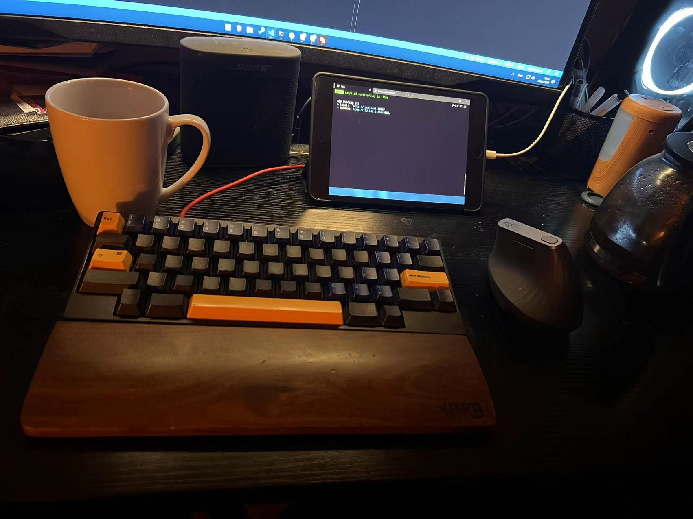

<!--
published: true
type: share
title: Development Log of this website
brief: This blog notes the development progress of this website, including why this website exists and how does it become what you see today.
cover: https://github.com/MohaElder/me/raw/main/src/assets/blogPics/devLogCover.png
date: 2022/3/19
-->

# What is this site for?

I built this website to showcase myself, photos I took, and to write blogs(like this one!).

# How is this site built(building)?

By my hands, my loyal HKKB keyboard, and a logitech ergonomic mouse. 

At first, I think I should use Wordpress or something like that(maybe wix, I see their Ads on YouTube everyday). But I figured that costs money and there are limitations.

> And hey! I'm something of a computer scientist myself, I can do this by myself.

Then I wanted to use somethign like hexo or GitHub Pages. Sadly, I find hexo hard to work with and GitHub Pages too simple. Eventually, I realized that GitHub Pages could be more than it can be(just reading markdown files). This website is built with `Vue` with some super good open source dependencies like `Vuetify` or `Vue-router`. The website supports CI/CD using Github Actions and the action deploys the site to <i>Github Pages</i>(shout out to Github Pages).

# DevLog

Beginning here, I will update the progress of my website's development.

## Features:

This website has 5 sections: Hi, Work, Life, Photos, and Blogs.

Hi: This section is to tell people about myself in a cool way. I am still thinking on what it should look like.

Work: This section is to showcase my work related experiences and skills, also to share my Resume(actually this is the true reason why I started to work on this website: find a place for people to download my resume)

Life: This section is to showcase my hobbies other than photography

Photos: This section is to showcase the picture that I took

Blogs: This section is to post my blogs