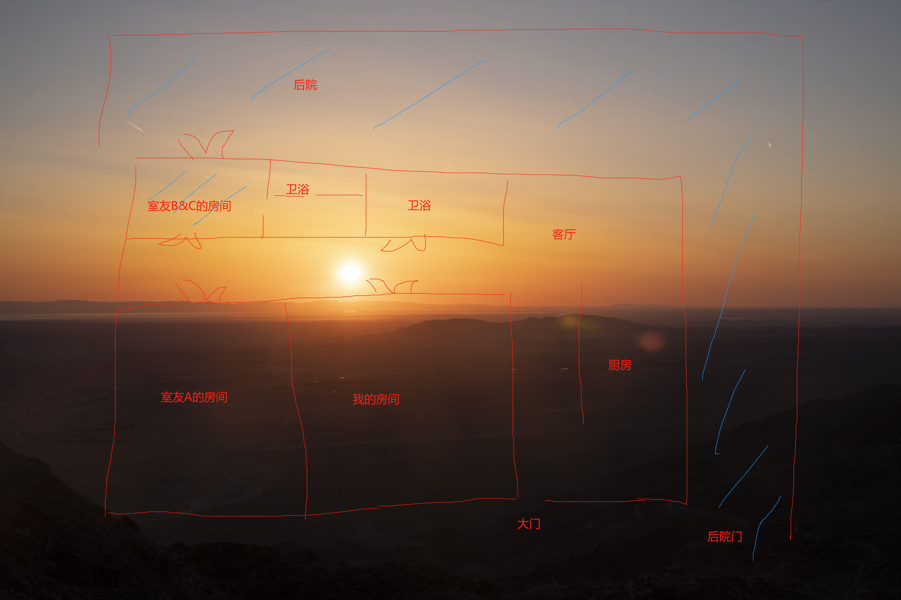
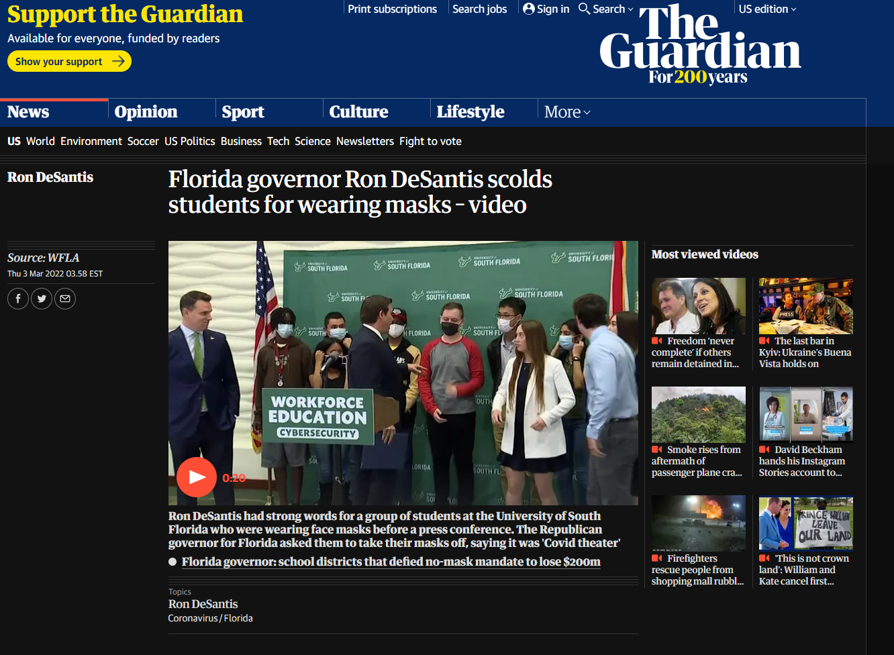

<!--
id: b33c27e1a98011ecbeb368545a57002a
title: 新冠轻症是什么体验？
date: 2022/3/21
color: #ffee58
brief: 作者在这篇文章当中回忆了新冠期间的生活及感受，并聊了聊新冠对自己的影响。
cover: https://external-content.duckduckgo.com/iu/?u=https%3A%2F%2Fstore-images.s-microsoft.com%2Fimage%2Fapps.47784.69945075044825416.99d4e5d8-fac1-421b-8986-d0fed49db992.3cffda34-9da3-4a35-a94e-da061aa0ce7f%3Fmode%3Dscale%26q%3D90%26h%3D1080%26w%3D1920&f=1&nofb=1
cover-caption: 
type: life
published: true
-->

# 前言

距离新冠康复已经三个月了，我现在身体还不错，写这篇文章之前刚刚吃了冒鸭血（我一个上海人做的最好吃的是川菜，这是令人意想不到的）。这篇文章的目的是为了分享我与新冠之间相爱相杀的故事，并提供一些我个人对新冠影响社会的理解。

虽然是冒鸭血，但是羊肉太多了所以都看不到鸭血了😓

# 零爆点

“卧槽，20点，早知道多下点注了”

“这波饭钱赚回来了，等会儿出去逛逛”

“妈的，街上全是大麻的味道，赶紧回房间吧”

“我先睡了，你们慢慢喝”

“他妈的怎么这么赌，一串红的跟赤道一样，一个小时的路开了三个小时了。”

“终于到家了”

“怎么睡了十个小时还累，今天早点睡了”

“行啊，我陪你去学校一趟。你感冒好点了不，我感觉我差不多好了不过眼睛还有点肿痛”

“他妈的，寒假打印机都关了。话说旁边有个测核酸的机器，咱们要不测一下呗，反正免费的。而且你明天就要去见你女朋友了，万一你得了就不用去了哈哈哈哈哈。”

“靠，感觉终于好一点了。应该没得，问题不大。”

“我操”

。。。

“我操，holy shit”

“我能进来吗，。。。你看一下你手机邮箱里面是不是也是”

> “我们他妈阳了”

以上对话是我和我室友得新冠前后的真实反映。我和我室友，加上我的两个小学同学（我的室友也是我的小学同学，只不过我们小学的时候不是很熟，是在做了室友之后变熟的）寒假去了死亡谷和拉斯维加斯游玩。回到家之后四个人里面三个人都得了新冠。我之后会讲到第四个没得的人。我们到现在都不确定是在哪里得的，不过可以确定的是拉斯维加斯，毕竟死亡谷没什么人。

我是最先知道自己的核酸结果的，然后我拿着手机上的结果给我室友看。他看到之后都震惊了，然后马上去看他的邮件，结果发现他也是阳的。我马上通知了所有我那几天接触过的人去做检测。幸运的是，除了另一名同行的小学同学，其他所有的人都是阴性。（我那个小学同学很奇葩，之后有机会可以讲讲她的故事）

# 新冠第一天

在发现自己阳性之后，我想到的只有一件事：<b>不能让更多人感染</b>

我和我室友戴上n95，开车到了最近的药房，在保证和其他人距离的状况下买了退烧感冒的药，水，和很多消毒的东西，并且用自助收银机结账，尽可能保证零接触。到家之后，我们规划了一整套隔离方案，将我们家隔离成了两个区域：

蓝色涂抹的部分是我们使用的区域，我和室友C调换了房间，与同样得了新冠的室友B同住。正好那个房间还有厕所和洗澡的地方。我们吃饭全部通过外卖解决，拿外卖通过独立通道去拿，全程零接触。

我们将整个家和车子消毒了一圈，并且通知了另外两个室友我们的隔离计划：

这个群的名字叫SanDiego苗床的原因是后来我们好了后室友A发现自己也阳了（应该是我们传染的），故称我们住的地方为新冠的苗床。

# 新冠对人最大的危害不是身体上的，而是社会上的

## 内疚

我在得新冠的时候受到最大的伤害是心理伤害。在这里，我非常坦诚地说：一开始非常想要隐瞒别人我的症状，因为我很害怕告诉了别人之后社会会远离我。不过这样的想法只存在了一分钟，理智和正义很快占领了我的思维并引领我做出了正确的决定：告诉所有人，你们现在是密切接触者了。

在告诉了大家之后，我陷入了深深的自责。哪怕理智和我的朋友们都在告诉我这根本不是我的错，但是我还是会非常内疚于可能传染给别人。那段时间我心里想得最多的就是希望我接触过的人们都不要得新冠。我担心的不仅是他们的健康，更多的是担心他们的心灵也会遭受我当时所遭受的煎熬。

我当时在我朋友的朋友的家里见了那个朋友，当时我间接影响到了整个他们家的人，真的令我十分内疚。

## 成为“电视里的人”

我相信很多人得了新冠之后和我一样都会产生震惊的情绪：天哪，我成为了那串数字里的一份子。与其相伴的是对整个隔离政策和新冠的了解，你在一夜之间变成了新冠专家。开始往最好的方向去想：说不定我三天后就好了。不过很快，周围人的反应让你觉得得了新冠不是等你好了就好了的。在很多人眼中，你还是一个“危险分子”。虽然我个人没有遇到，但是我知道不少得了新冠的朋友都成为了别人眼中的众矢之的，哪怕是他们阴了之后还是会被要求去哪里之前做一下核酸确保真的没事，并且随时都会有人问你有没有后遗症（这个我也遇到过，真的很讨厌，我有没有后遗症关你屁事，我觉得一个人的症状真的是一个很隐私的事情）。我突然想起来，之前还有一个人莫名其妙加我，然后问我咋知道自己得了omicron，然后还反复和我确认我是咋测试的，真的很让我摸不着头脑，现在想想还蛮生气的。

# 得新冠第二到十天：

我是一个乐观的人，即使遭受着巨大的心理压力和新冠前几天的病痛，我也苦中作乐，随时在拍照记录生活。

我每天都会在B站发布自己当天的感受，并且分享自己当时的生活。我觉得记录自己那段时间的经历是很重要的，因为他们听上去是我人生很重要的事情（其实我希望不是，原因我会在后面讲到）。

<iframe src="//player.bilibili.com/player.html?aid=892772696&bvid=BV1LP4y1n7so&cid=474471041&page=1" scrolling="no" border="0" frameborder="no" framespacing="0" allowfullscreen="true"> </iframe>

我严格遵守着CDC建议的新冠治疗方法：喝水

目前没有新冠的特效药（至少在我得的时候），能做的只有喝水，让身体快速代谢，排出病毒。我当时每天都喝七瓶水，和水牛一样。我感觉那段时间我喝的水可能有平常一个月的量。

除了喝水，睡觉，吃喝拉撒，我当时花了大量的时间在<i>辐射4</i>上。

我其实在辐射4刚出的时候就买了，当时玩了几个小时玩到了钻石城，没有性子继续玩下去了。这次疫情让我得以静下心来，好好在废土里探索。在家隔离的十天成为了辐射4里的无数个日夜，我在兄弟会的机场策划了最完美的背叛，也从Piper身上背负了到现在也无法释怀的愧疚。

辐射4的世界观也让我陷入了一定程度的思考。游戏世界起源于一次世界战争，世界毁灭于核弹之下，地表成了废土。在那之后过去了一千多年，人类慢慢复苏。对于地表的核扩散，整个辐射4的世界有大概三种意见分别由三个势力持有。

### 地表居民：核辐射已经减弱，与其共处才能正常生活

大部分生活在地球上的人都选择以聚落的方式在地表居住。经过一千多年的时间，核辐射已经消退许多，人们对核辐射的耐受性也渐渐强大了起来。对于这世界上的大部分人来说，相比核辐射带来的那“微不足道”的伤害，更重要的是活下去。要是一辈子都躲在地下，我吃什么？喝什么？对于他们来说，生活的压力让他们无暇应付“所谓的核辐射”。

### “研究所”：地表文明已尽，新世界属于地下

研究所是一个由世界顶尖科学家建立的组织，他们在核战发生前的一刹那躲进了地下研究所。他们拥有整个辐射世界最好的生活环境，没有污染，能源取之不尽。绝大部分研究所的居民一辈子都在研究所当中度过。

### “核能之子”：核辐射是福报，我们应该拥抱它

核能之子是一个比较宗教化的组织。核辐射是他们的信仰。他们认为核辐射对人们造成的影响是一种进化，因为人类拥有了承受核辐射级别伤害的能力，这是免疫力的一种质的飞跃。有意思的是，在游戏当中，核辐射看上去确实对他们没什么影响。

# 我们每个人都有权利选择如何面对新冠，但共识与和解才能使世界进入后新冠时代

现实世界中人们对待新冠的反应就像辐射4一样，只不过绝大多数人选择了“地表居民”和“研究所”这两个阵营。

新冠是否严重？答案是肯定的，他让无数人到现在都还躺在重症监护室。摧毁了数不清的家庭，打碎了不知道多少个人的生活。但现在的新冠是否严重得让这一切值得? 我相信这是一个值得讨论的问题。

## 不过可以肯定的是，2022年，对人们影响最严重的东西不再是新冠，而是<b>围绕新冠发生的事件</b>。

### 地表居民：得了就得了，生活照旧，不过仍有重症与死亡。
选择与新冠共存的人们很快恢复了疫情前的生活。街上渐渐恢复了往常的热闹，仿佛一切都回到了以前的样子。但是时不时发生的死亡和重症病例依旧使新冠成为了社会的夜魔人。我们相信那些重症和死亡病例都是因为没有打疫苗。但是新冠疫苗也仅仅推出两年，根本不具有其他疫苗那样的鲁棒性。即使是打了疫苗的轻症患者也出现了后遗症。新冠是否已经变弱？我们还无法得出结论。我们虽然过着看似正常的生活，但仍然处处提防着新冠。

### 研究所: 积极抗疫，严防死守，灭绝新冠
有的人选择和新冠抗争到底。一些国家采取了严格的防疫政策，有效制止了病毒的入侵。新冠在这些国家得到了周期性的消灭。但严厉的防疫政策也带来了一些不好的后果。这些国家的经济受到了严重的影响，许多人的生活因为政策产生了巨变。严厉的政策也误伤了不少无辜的人。“是否应该像那些地表居民”成为了这些人当中讨论最多的问题。有一点可以确定的是，没有人希望成为商鞅。

### 核能之子：阴谋论者
?

## 共识与和解

不论你是哪一方，我们都生活在一颗星球上。共识与和解是世界进入后疫情时代的必要条件。人们与其选择站队一派，不如对当下的局势进行理性的分析，提出合理的策略。疫情当下，我们应该将那些无聊透顶的矛盾放到一边，团结起来解决问题，而不是利用疫情去处理那些矛盾。我相信在不久的将来，我们将团结在一起，重新回到2019年。

# 新冠痊愈

不好意思，扯远了。在十天之后我痊愈了。重新获得自由真的很开心。在那之后，我经常鼓励身边得了新冠的朋友，向他们建议隔离时的生活方式。在这段“新冠之旅”当中，我觉得最重要的就是找到心理的慰藉。如果你恰巧也阳了，请一定要注意保持一个积极乐观的态度，它将成为你战胜新冠最好的武器~

### P.S: 如果大家对我的新冠之旅感兴趣，可以去B站收看我的[十天vlog](https://www.bilibili.com/video/BV1LP4y1n7so?share_source=copy_web)，是比较真实的阳了之后的记录。