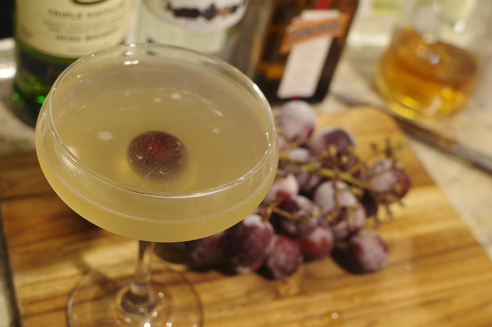
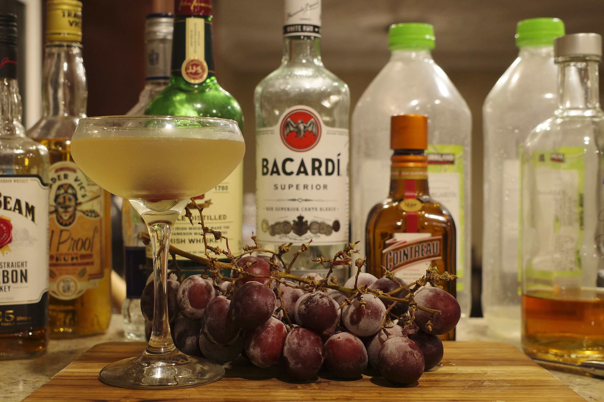
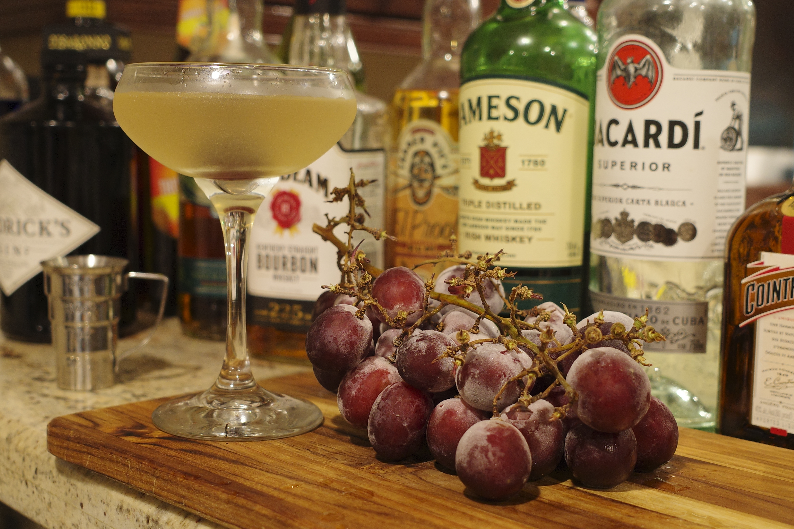

<!--
id: bb309f2fb17011ecbef668545a57002a
title: [鸡酒分享] 玉光葡汁
date: 2022/3/31
color: #64b5f6
brief: 分享一款之前有一天喝酒即兴调的还不错的配方，自由度较高。
cover: https://github.com/MohaElder/me/raw/main/src/assets/blogPics/grape_juice/grape_cover.JPG
cover-caption: 
type: share
published: true
-->

春天是过渡性的季节，人们拥抱温暖，也害怕即将到来的炎热。

在如此季节，一杯冰凉的饮品不仅能带来好心情，也能消除人们对酷暑的恐惧。

## 玉光葡汁

我今天想要分享一款最近一天晚上调出来的酒，原因是家里的葡萄快不能吃了所以想要赶紧用掉。这款鸡尾酒叫做<i>玉光葡汁</i>，名字来源于李白的《将进酒》（这个名字当然是我后面想的）

> 钟鼓馔玉不足贵，但愿长醉不复醒。\\ 五花马、千金裘，呼儿将出换美酒，与尔同销万古愁。

以及王翰的《凉州词》

> 葡萄美酒夜光杯 欲饮琵琶马上催

玉光葡汁的酒体呈淡淡的玉色，中间点缀的葡萄因为酒杯的造型正正好好落在中央，宛如一颗紫红的明珠。在春天的晚上喝上如此一杯美酒真的是太爽了！

## 口味分享

刚入口是rum的甜味和cointreau的橙香甜味；到达舌头中后部时能够察觉到伴随着Irish Whisky微辣和顺滑口感的葡萄香甜味；饮毕能到中强度的后劲，提醒着你这一款甜酒度数不低。

适合喜欢喝甜一点的酒或者想要尝试以鲜榨水果为原料的酒的朋友们。

## 配方

1. 7 ~ 12颗鲜榨葡萄（看葡萄甜度）
2. Irish Whisky 30ml / 1oz
3. Rum 45ml / 1.5oz
4. Cointreau/Triple Sec 30ml / 1oz
5. 冰

## 器具
1. Shaker
2. Jigger或你的直觉
3. 酒杯（文中使用的是Coupe Glass）
4. 手动榨汁器
5. 小刀

## 步骤

1. 将葡萄洗净，用小刀切成两半，方便后面榨汁（这里我傻逼了，葡萄冷冻了，效果不是很好，建议大家用新鲜葡萄）

2. 将冰块放进Shaker

3. 将葡萄放进榨汁器，果肉对准下面，然后榨进shaker里面

3. 将Irish Whisky，Rum，和Cointreau依次量好导入Shaker

4. 充分摇晃Shaker，让琼浆玉液产生碰撞，并进行一定程度的化水，快速降低液体温度

5. 将酒从Shaker倒入酒杯，并加上葡萄点缀

## 完工，真的是绝绝子哦

 希望大家不论再忙，也要抽一天晚上享受当夜的美好🌙 
