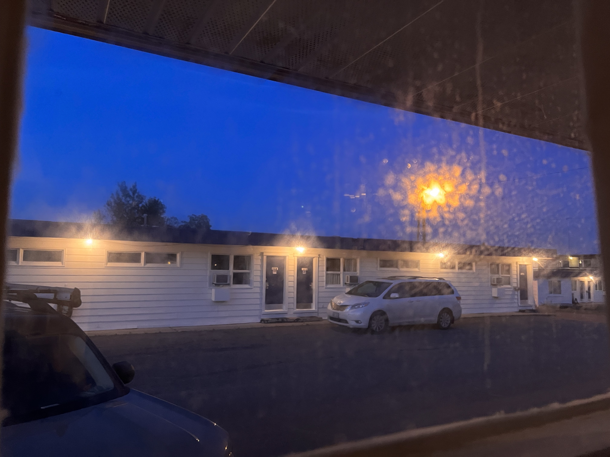

<!-- 
id: 2d3b5e70faf311ec9fe5acde48001122
type: life
title: 在靠近北极的镇上住一天是什么样的体验
brief: 我“被迫“体验的三天隐居生活
cover: https://raw.githubusercontent.com/MohaElder/me/main/src/images/20220701-_DSF5495.jpg
date: 2022/7/3
-->

> "很多旅途当中最精彩的时刻是在意外和妥协中产生的"

## 我被“困在了“北极边的小镇

小镇的大概位置，北极圈就在上方不远处

我宏大的阿拉斯加旅行计划在意料之内地出了意外，原本我应该在写文章的此刻到达进入阿拉斯加前的最后一站，可我现在却仍在最后一站的前一站：距离阿拉斯加25小时车程的小镇：Fort Nelson。

我被困的原因是因为前往阿拉斯加的高速，aka阿拉斯加高速，在小镇和最后一站中间产生了一个大洞，所以路被封了。什么时候路修好了，就能继续走了。

大洞的事情我是从房东那里知道的。有一说一，房东人很好，最后还帮我退款了。

这个洞是不是很大

在我发现了这个大洞之后，其实我还尝试了往阿拉斯加那里开，在亲眼看到了路被封了之后只能打道回府了。在回去的路上我还遇到了一个很有意思的搭车大叔，不过那个故事之后再讲吧。

## 吃穿住行，在“北极边”的小镇

Fort Nelson是人们从各地通往阿拉斯加的一个重要中途站点。它在二战时期便承载着重要的补给与休整使命。如今也是，Fort Nelson作为到达最后一站之前唯一有网络的小镇，它成为了我唯一可以选择歇脚的地方。

因为可能要停留数日，我并没有选择在车上露营。我选择了当地的一个汽车旅馆，价格很不错，房间也很好。

其实住车上也挺舒服的，就是一直住镇里不太好，露营更适合野外

这个汽车旅店是不是还不错

### 善良的旅店前台

旅店有洗衣机，我在当天的八点多入住，想去洗衣服。我到了洗衣间门口发现洗衣房已经关门了。正当我想返回时，前台的印度小哥走过来，他说他可以帮我洗掉。我把我的那包紫色薰衣草香味垃圾袋包装的脏衣服递给了他，并且在过了一个多小时后拿到了洗好烘干好的衣服。我当时还打算给小哥五刀的小费，小哥笑笑摆了摆手便走了。

<!-- take selfie here -->

### Tim Horton，Boston Pizza，还有自制蒜蓉鸡翅

小镇虽然不大，但是五脏俱全。我入住的房间可以做饭，便在第一天晚上去到镇上的超市买了点菜给自己做了一顿简餐。事实证明，会做饭对吃到符合自己胃口的菜帮助非常大。

饭后小酌一杯也是很不错的，图中的酒杯是我在Oregon一个小镇的古董店淘的

后来被迫呆在小镇的几日，我毫无意外地享用了Tim Hortons和Boston Pizza，两家遍布加拿大的连锁餐厅。值得一提的是，Boston Pizza的酒吧很便宜，一杯cocktail只要不到8加币，折合人民币都要比上海的cocktail便宜。

问调酒师要了一瓶随机调的酒，当然是Canadian Ginger Ale + Gin

## 一天就能探索完的小镇，使我在第三天成为了原住民

Fort Nelson真的很小，它的中心城区就沿着阿拉斯加高速。我来这里两天已经几乎尝遍了所有的餐厅。除了餐厅以外，两家加油站，一家博物馆，一个电影院，几家商铺，和一个超市构成了这个小镇的中心地带。事实上，除了中心地带以外，Fort Nelson也只有十几栋围绕着主路的民居支撑着小镇寥寥的人口。

小镇的Domino Pizza只有一个员工，负责收银和厨房

可能是因为道路封闭所以没什么游客，同时居民更喜欢自己做饭的关系，餐厅里都没什么人。我往往是餐厅里面唯一一个人。在街上也是，除了偶尔穿梭在主道上的车辆，我几乎看不到什么别的人烟了。

因为顾客真的只有我一个，我感觉这座城市仿佛是为我而开一般。整个旅店只有我一个人登记入住，超市的收银区也不怎么需要排队。我甚至闯个红灯或者酒驾都没有人管。在这里，遵守交通秩序成为了一种对城市生活的致敬。

<iframe allow="autoplay *; encrypted-media *; fullscreen *; clipboard-write" frameborder="0" height="175" style="width:100%;max-width:660px;overflow:hidden;background:transparent;" sandbox="allow-forms allow-popups allow-same-origin allow-scripts allow-storage-access-by-user-activation allow-top-navigation-by-user-activation" src="https://embed.music.apple.com/us/album/cayman-islands/724403401?i=724403477&l=zh"></iframe>

这首歌很适合在这个小镇上边走边听，你会感觉自己跟路边的鸽子一般自由且漫无目的

## 北极边的小镇也是有极昼的

这张照片摄于晚上十一点三十四分。日照时间在夏天的时候往往都很长很长。在圣地亚哥，天大概要八点半黑。在西雅图，一般是九点半。而从温哥华往上一点的地方开始，你就完全见不到黑夜了。

我通常会人为制造黑夜：睡在车里的时候给车子盖上遮光板，睡在旅店时拉上窗帘。

<video width=400 src="../assets/blogPics/night.mp4"></video>

有的时候我从旅店出来被强烈的阳光照射时，我都不知道现在到底是几点。

因为极昼的关系，晚上九十点我喝完酒在路上漫步的时候也毫不担心自己的安全。因为街上还跟清晨一样明亮。我仿佛像是一个在大白天喝酒的醉汉一般流浪在街头。

酒吧在小镇的另一端，其实也就是走路10分钟的事情。Fort Nelson的路非常宽，人又少。我走在上面有一种走在中国西北或者内蒙古城市的感觉，比如赤峰。

## 末

在我写这篇博客的时候，我仍然不确定第二天能不能离开这里。也许我今天晚上就走了，也许我可能会在这里继续呆一周。不过即使我需要在这里继续逗留，我产生的负面情绪也仅仅是来自未来计划的破坏而已。在Fort Nelson的几天，我已经渐渐习惯了这里的生活。虽然它不像大城市那样有那么多活动，也没有那么多壮丽的自然景观，但是小镇简单的地理/人际分布以及温馨舒适的旅店为我提供了几日我渴望已久的“隐居片刻”。

也许当我们在渴望逃离都市时并不追求去到深山老林或是无人的小岛，我们只是希望从费心费神的社交活动中得到解脱，忽视各种社会上隐形和明文规定的条框。在Fort Nelson，我不需要跟人打交道，也没人在意我的所作所为（其实在哪里都没什么人在意）。

我每天做的就是：早上起床去隔壁的咖啡厅吃个早餐，下午在附近的餐厅吃个中饭，下午在镇上的电影院看个电影或者宅一个下午，晚上去酒吧喝两杯然后迷迷糊糊地晃回旅店大睡一觉。

> 这就是我心目中的最佳隐居生活。

## 附注

我困在Fort Nelson这几天在附近找到的湖泊和山脉。我很开心它不出名（甚至网络上没什么它的踪影）。

