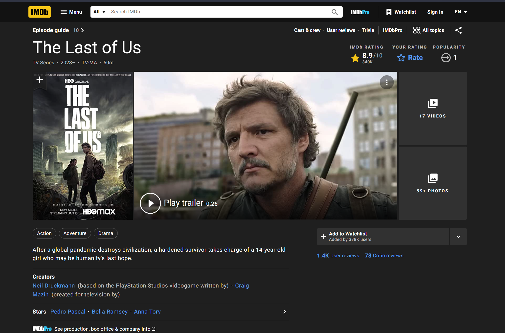
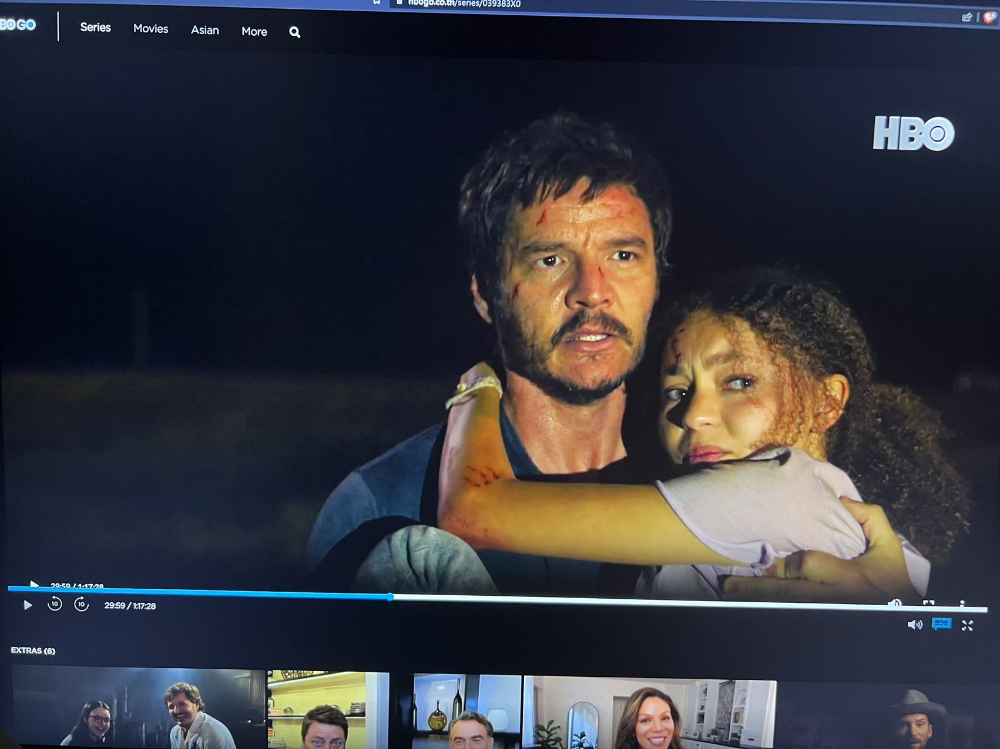
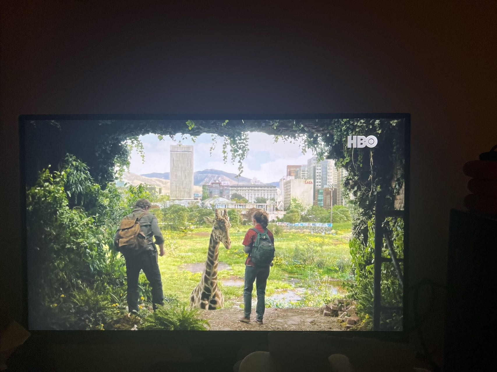
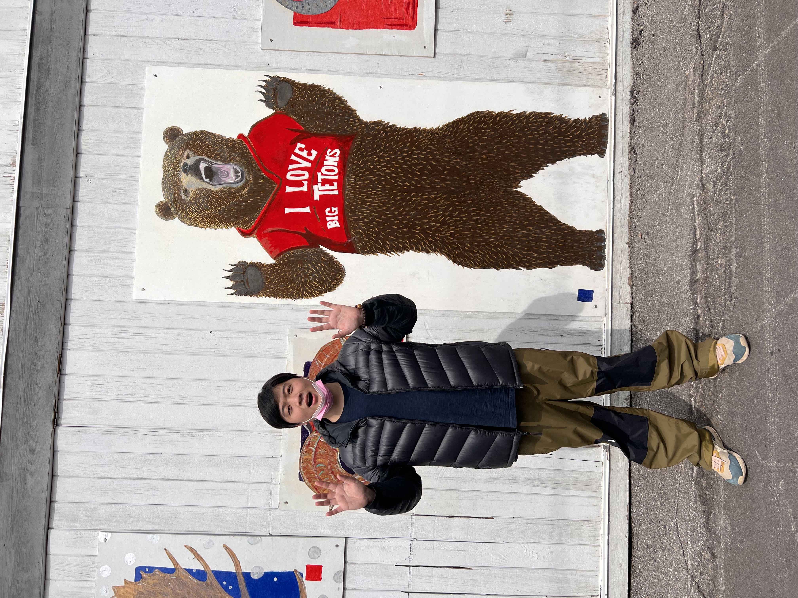

<!-- 
id: 1d0e79fdcbe211ed9db368545a57002a
published: true
type: comment
title: 简评美剧最后生还者 - 史上最优秀的游戏改编影视作品
brief: 通过我和曼谷的故事寻找你需要知道的关于曼谷的一切
cover: https://3.bp.blogspot.com/-4x8cvvXQ8sE/WBEUGkpSRlI/AAAAAAAACJ0/z4KqUuQovyoPENSS8eYKi2lf0x_wQzwdQCLcB/s1600/The%2BLast%2BOf%2BUs%2B2.png
date: 2022/7/8
-->

## The Last of Us
The Last of Us, 最后生还者，是一个发售于2013年的动作游戏系列作品。游戏以丧尸病毒爆发的后疫情世界为背景，以一个失去了女儿的父亲和一个对病毒免疫的女孩作为主角，讲述了他们的冒险故事。游戏一经出售便以其极其出色的技术，玩法，剧情，和音乐收获了极高的口碑和销量。在当年斩获了数个重量级游戏奖项，被认为是2013年的年度游戏。

最后生还者系列在2020年发布了续作。虽然该作延续了前作极高的游戏质量，但是由于剧情十分具有争议性，很多玩家不愿意接受剧情，称该作为糟糕的“同人作品”。巨大的舆论冲击使这款游戏被许多人认为是烂作，但其实抛开争议性的剧情，游戏本身质量十分出色，在当年也获得了年度最佳游戏奖项。游戏制作人，游戏主要编剧Neil Druckmann因为该游戏的剧情及其在社交媒体上对玩家口诛笔伐的不屑也使其风评骤然下降，甚至招致了对游戏工作室Naughty Dog的谩骂。

2023年，HBO发行，游戏制作人Neil Druckmann编剧和监制，切尔诺贝利导演Craig Mazin导演的最后生还者电视剧上映。这部电视剧一经发布便好评如潮，我在看完第一集后脑子里的的一个问题便是：**这部电视剧能不能让人们对Neil Druckmann的评价有所上升？**

## 史上最优秀的游戏改编影视作品 - 全靠同行衬托

好吧，我承认这有点标题党。我个人认为这部电视剧确实是我看过的最好的游戏改编影视作品，市场上也有一些优秀的游戏改编影视作品（赛博朋克，巫师，光环 - 虽然很多人骂但是我个人很喜欢，Arkane，杀手47 - 很像约翰维克的那部）。

看到这张图就emo了

但是大多数游戏改编的影视作品真的很烂：刺客信条，真人快打，魔兽，真人皮卡丘，另一部杀手47，三国无双。Hmm，这么一看，貌似电影大部分都很踩雷，电视剧都还行。

皮卡丘可爱捏，可惜电影太难看了

很多玩家在得知一款游戏将改编成电影的时候都会感到害怕，不过大家还是会去看，哪怕知道质量堪忧。

当最后生还者要改变美剧的消息放出，并且大家得知游戏女主Ellie将由与原作Ellie长相完全不符的Bella Ramsey出演的时候，很多人也对该剧的质量感到担忧。（我觉得因为选角的外表而抨击一部作品这个举动其实很傻逼，因为它是一个很低俗肤浅的衡量方式。我觉得喷美剧里Sara和Maria变成黑人和骂迪士尼小美人鱼主角是黑人也挺傻逼的）

美剧的服装还原得也很好，这件是经典战衣了

## 一部好的改编作品应该忠于原著

imdb 8.9的高分，hbo在第一集播出后就续订下一季

在第一集播出后，玩过游戏的观众就知道自己不用担心这部剧成为另一个《动画版三体》了。第一集真的是完美还原了游戏开头。事实上，第一集是整个第一季里最贴近游戏的一集，第一集节奏跟游戏基本保持一致，内容甚至比游戏更丰富。它完整还原了所有游戏开头里发生的故事，并添加了丰富的细节补完。

这个镜头除了演员的选角和相反站位，基本和游戏里的镜头一模一样，可以说是像素级还原

比如我觉得游戏里Joel叫Sara赶紧走其实稍微有点仓促。但是在剧集发生的狗狗找Sara和Sara遭遇被感染的老奶奶的剧情完美满足了我的遗憾，也使观众很自然地沉浸到了最后生还者的世界中。一开始Sara去修表，然后钟表店的人提早关门并叫Sara早点回家的剧情我也很喜欢。

在后面的剧集里，虽然有很多节奏和篇幅上值得诟病的点，但是整个系列并没有任何“不忠于原著的改编”。演员出色的演技对剧集版忠于原著也做出了很大的贡献。基本上所有演员都演技在线（除了叛军那几个人，我后面会批评），尤其是Bella演得真的很好。随着剧集的播出，对Bella选角的批评也越来越少了，这就是观众对Bella演技的认可，连肤浅的人都知道Bella演得很好。Tess的演员Anna Torv也演得很好，我很喜欢。

Tess可怜捏，还原度很高

## 出色的改编和原创剧情

如我在前面提到的，最后生还者剧集版在忠于原著还提供了很多细节的补完。这些细节让整个最后生还者的世界观更真实有趣。在细节补完上，第二集做得最好。开场印度尼西亚的那段实验室检验直接切尔诺贝利风格拉满了，后面对波士顿隔离区的细节描写也让我们对最后生还者世界观有了更全面的认识。

在游戏当中，重心被放在了Joel和Ellie之间的故事上。但是在剧集版里，我们看到了更多对其他人物和整体场景的描写。我觉得这个是剧集版和游戏版最大的区别，也是剧集版最大的亮点之一。不过可惜的是，这样的改编和原创剧情在第三集之后越来越少。后面的剧集确实有很多出色的改编和细节，但是显著的篇幅缩略带来的节奏加速使得这些亮点越来越少。

一集四十分钟根本不够看啊

### 第三集 - 不仅是原创剧情的巅峰，也是2023年最好的同性恋题材影视作品

最后生还者剧集版的第三集绝对是其最有影响力的一集，吸引了很多游戏圈外的观众。

第三集对游戏剧情做了极大的改编，花了一集的篇幅讲述了Bill和Frank这对在游戏里基本没什么戏份的情侣的故事。

突然发现Bill还原度也挺高的

第三集在最后生还者完整的世界观里讲述了一个很简单的爱情故事，就是一个人救了另一个人，然后他们在一起白头到老。但是第三集的故事并不俗套。我觉得一个故事俗套是因为你能从这个故事上看到浓烈的引经据典。第三集的故事虽然简单，但是它的呈现原创性极佳。

第三集里有很多设定都非常棒，比如Frank难民的来历，还有Bill末日准备者初期的准备工作。这些设定都很真实，满足了我们对于主线故事之外的世界的延展想象，使让最后生还者的世界栩栩如生。这些优秀的设定使第三集简单的故事没那么简单。打个比方，第三集里面最有名的草莓片段。Frank为Bill种了一些草莓作为惊喜，一个很简单的爱情桥段。不过在这个桥段背后，Frank种草莓的种子是他用Bill的两把枪跟走私犯换的（这里有两个点：Bill有很多枪、种子和枪一样珍贵）；Frank种草莓给Bill当作惊喜不仅是因为Bill爱吃草莓，更因为疫情原因Bill已经二十年左右没吃过草莓了。若干诸如此类围绕最后生还者世界观的补充细节使第三集简单的爱情故事生动真实，让整个故事饱满了起来。

他们真的，我哭死

除了这些优秀的故事细节，两位演员出色的演绎讲好了这个简单的爱情故事。Bill和Frank都演得非常非常非常好，尤其是最后的片段，两个演员都真的演得太好了。大家感兴趣可以网上搜一下他们的片段，光是看单个片段就很有感染力。

最后，**我认为第三集是2023年最好的同性恋题材影视作品是因为它并没有强调同性恋**。我觉得很多同性恋题材的作品都用力太猛了，一直在强调同性恋这个身份，最后什么都没拍好，只剩下喊口号。第三集拍了一个出色的爱情故事，同时这个爱情故事自然地围绕一对中老年男同性恋情侣开展，并没有刻意强调中老年男同这个元素。我认为这种以故事为中心的影视作品才能有效地向观众传达其想要表达的东西。

## 不如原神的部分 - 丧尸太少，中后期故事仓促

相信很多游戏玩家都会觉得剧集版的最后生还者丧尸太少了。在看第一第二集的时候我觉得最后生还者的丧尸很给力，尤其是第二集clicker的那段，我觉得是整季最好的丧尸戏，直接有游戏里的那种感觉了。

Clicker恐怖捏

第三集几乎没有丧尸我能理解，第四集我也能理解毕竟剧情就是城市丧尸清零了。到了第五集开始，其实我就有点想念丧尸了。虽然第五集也确实出现了本季理论上丧尸最多的场景，但是它太短了，短到我感觉看丧尸跟看大熊猫一样珍贵。

在这集之后丧尸就只出现了两次：Ellie回忆杀和最后一集开头。我觉得作为一个丧尸是主要内容之一的故事来说，丧尸的高存在感是有必要的。在游戏里，玩家搏杀丧尸的过程合理解释了Ellie和Joel之间的患难见真情。在剧集里Ellie和Joel的关系更多是通过关键剧情推进，但是在缺少来自丧尸的不定期冲突下，观众其实还是比较难理解Ellie和Joel怎么这么快就关系那么好了。我建议第二季至少每一集都杀点丧尸，搞搞两三分钟的动作戏，会对整个剧的观感提升很多。

游戏里的丧尸压迫感非常强，建议大家有机会体验一下

**Joel和Ellie之间的关系增长的“突兀”不仅是因为缺少来自丧尸的冲突，还因为篇幅的限制。或者说，缺少丧尸很可能是因为篇幅限制导致的。**我觉得第一集到第三集的节奏都很好，但是从第四集开始，你会发现剧情开始变快了。首先是引入了叛军女首领的故事，这个故事说实话是我觉得这一季做得最拉的故事。这个女首领对她哥哥的感情根本就没渲染够，然后最后莫名其妙被Bloater杀死了。

虽然剧情有点拉，但是Bloater呈现得很帅

我估计这个桥段想让观众觉得坏人死了大快人心，但是我并没有这种感觉，因为我感觉我还没完全认识这个反派。我觉得这一集其实可以有两种方式更好：1. 花更多时间讲女反派和那个老头的故事，然后花一些篇幅以它哥的视角讲故事；2. 不要女反派这条线，改成讲下水道英雄的故事，用现代线和过去线双线叙事。现在这个第四第五集有点没做完的感觉，不过第五集结尾依旧很震撼。

不好意思，我发现我花太多篇幅吐槽第四第五集了，我真的很不喜欢这两集。不过中后期故事仓促不仅是体现在这两集。如我前面提到的，Joel 和Ellie之间的关系进步飞快到有点突兀。如果你去看Joel见到他弟那集，Joel和Ellie在Ellie房间的对角戏可以说是出色的尬剧。它很出色，因为演员演得确实很好，它有些尬，因为观众还没准备好。

Joel和Ellie的确经历了很多苦难，他们在第五集的互动也很可爱。但是他们在第三集还是货物和送货员的关系，经历了比较混乱的第四第五集就突然是父女级别了，这实属有点飞快。

不光是Joel和Ellie之间的关系突兀，在第八集里Ellie和David的关系也突飞猛进。游戏当中他们是经历了共同抗击丧尸的遭遇之后Ellie才放下她对David的戒备的（看到没有！丧尸真的很重要）。结果在剧集里Ellie突然就从冷面杀手变成对David讲的话很好奇的篝火女孩了。类似的例子还有第四集叛军女首领和她哥的关系。其实篇幅短也能讲好人物关系，第七集Ellie和Riley的人物关系就处理得很好。

我很喜欢这个镜头，很好地诠释了少年时期友谊当中来自一方明显的朦胧的爱

中后期故事的仓促还导致了后期观众感受不到Joel和Ellie冒险的艰险。其实玩过游戏的朋友就知道，这趟旅程真的挺曲折的（还是因为丧尸！）结果在剧集版里面，感觉好像Joel和Ellie就是开开车走走路就到了。中间也就遇到两三次事情，好像其他时候都很顺利。这种错觉就是剧集版的短篇幅导致的，而且因为我玩过游戏的原因，这种感觉还好一些，对于没玩过游戏的观众来说影响真的比较大。没办法，50分钟一集确实不能塞太多东西。建议第二季每集都学习第一季第一集1个小时20分钟（我本来以为每一集都和第一集那么长，结果发现被骗了！！！）。

### 40分钟的最后一集
说实话，我一开始看到最后一集只有40分钟的时候觉得有点侮辱人了。最后一集不要求你超长，但至少保持标准的50分钟吧。40分钟去掉片尾和片头就35分钟。然后你要在35分钟里讲完整部剧最大的转折，其中包括起源故事，排除万难到达医院，面见marlin，得知真相，薄纱医院，结尾对话。基本上每个片段只能有五六分钟。虽然最后一集其实拍得很好，我很喜欢。虽然篇幅很短，最后一集把每一分每一秒都用在了刀刃上。但这并不影响最后一集可以因为时长的增加更好的事实。如果最后一集能有一个小时，它能在已经很好的基础上好更多更多。

最后一集拍得好是因为这两个片段拍得好，要是这两个镜头有一点点拍砸了，那这集就是弟中之弟

## 结语

最后生还者的剧集版虽然有很多做得不好的地方，但是这并不影响它成为我2022到2023三月最喜欢的电视剧。原著本身出色的故事，剧集忠于原著的改编，精彩的原创内容，以及超一线的呈现效果使其成为了HBO历史上仅次于权力的游戏的热播剧集。大家有机会一定要去看一下。最后回答一下我在文章开头的问题：
> 这部电视剧能不能让人们对Neil Druckmann的评价有所上升？

也许吧，不过这不重要。厌恶他厌恶到厌恶一切和他有关系的事物的人自然会继续厌恶他。理性的人会喜欢自己喜欢的东西，而不是在决定喜欢一个东西之前先看看它是否符合自己的立场。

最后分享一张笔者在最后生还者Tommy住的小镇Jackson的真实原型：美国黄石公园附近的Jackson小镇，与当地棕熊共同拍摄的一张照片。这个小镇很漂亮，和游戏以及HBO剧里面一模一样。推荐大家有机会去黄石公园的话顺便去一下。
